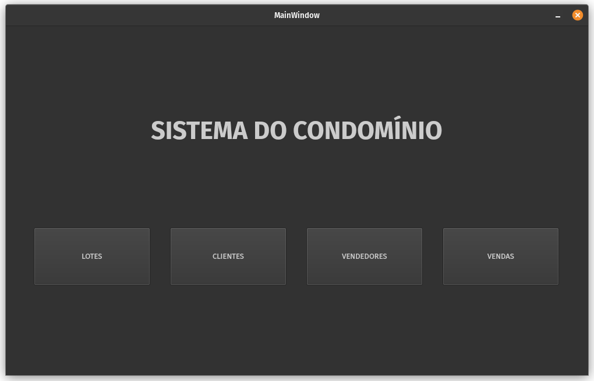
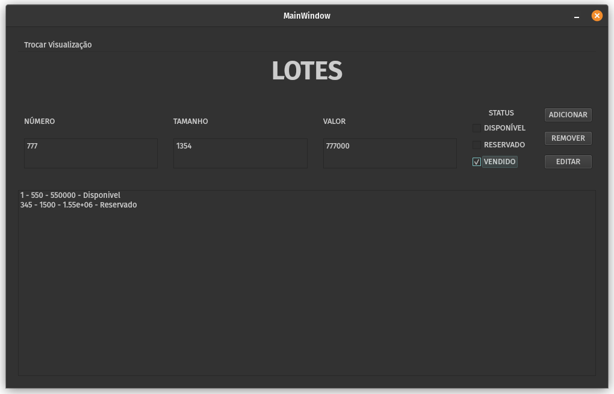
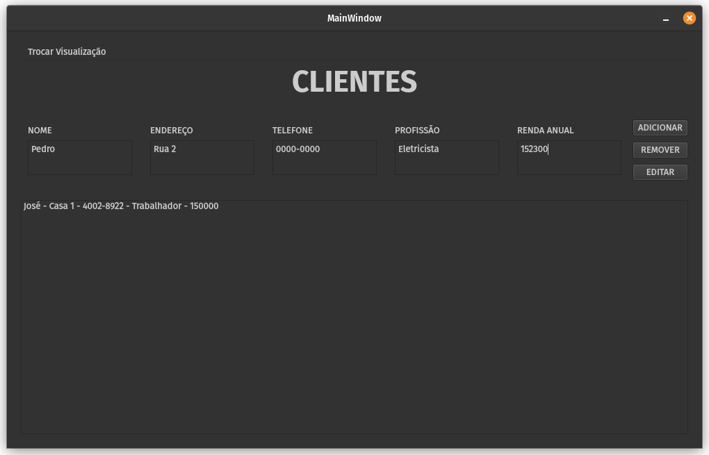
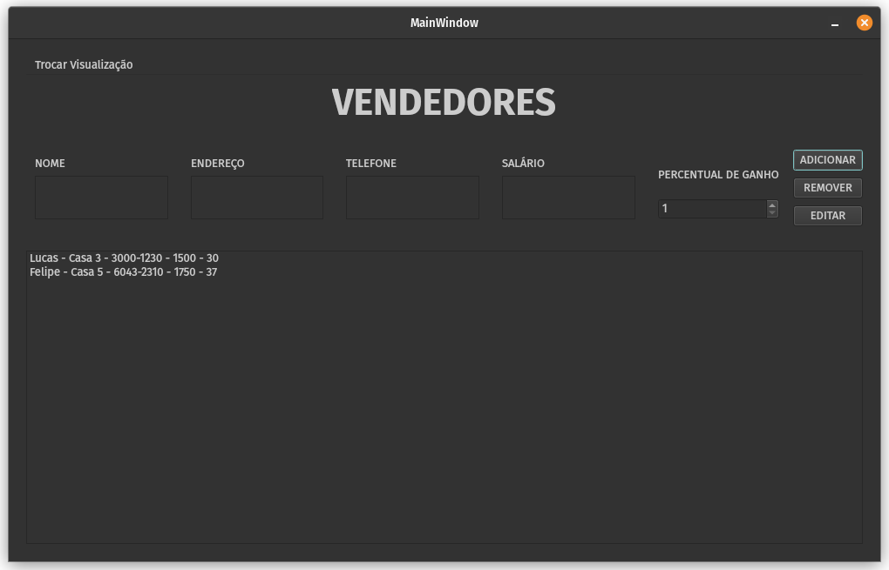
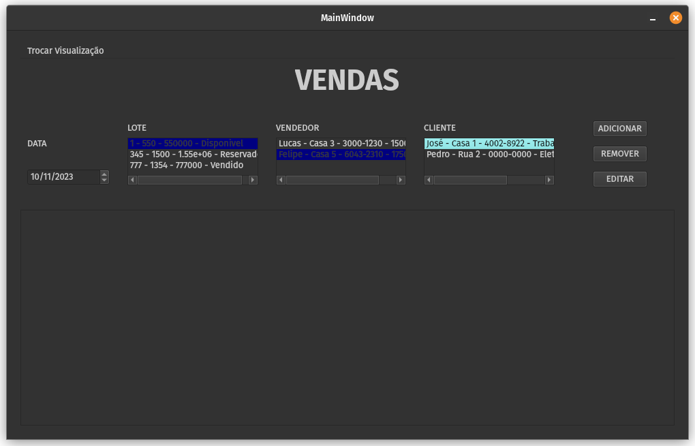
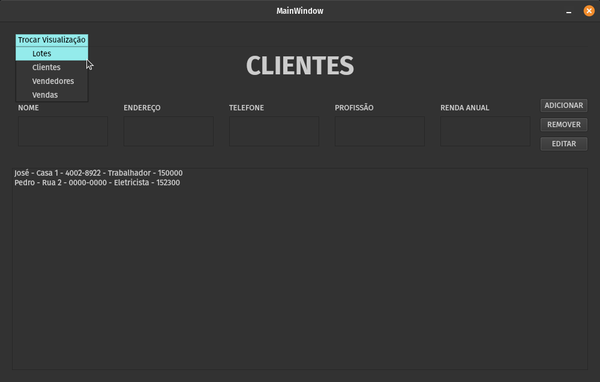

# Controle de Lotes

Esse repositório contém arquivos da atividade extra de Programação Orientada a Objetos, a interface gráfica para o controle de vendas de lotes em um condomínio foi feita utilizando o Qt Creator.

- [X] Cadastro: permitir o cadastro de novos lotes, clientes, e vendas.
- [X] Gerenciamento de lotes: permitir a visualização, alteração e exclusão de 
  lotes.
- [X] Gerenciamento de clientes: permitir a visualização, alteração e exclusão 
  de clientes.
- [X] Gerenciamento de vendedores: permitir a visualização, alteração e exclusão 
  de vendedores.
- [ ] Gerenciamento de vendas: permitir a visualização, alteração e exclusão de 
  vendas.

**ADICIONAL**
- [ ] Lógica para aba de vendas -> Mostrar apenas lotes disponíveis
  - [ ] Lotes reservados ou vendidos devem aparecer apenas na lista.
- [ ] Lógica para aba de lotes -> Lotes adicionados como "Vendido" ou "Reservado", devem ser atribuídos uma data, cliente e vendedor
  - [ ] Quando forem adicionados um "Vendido" ou "Reservado", abrir pop-up com as opções para data, lista de clientes de lista de vendedores.
- [ ] Lógica para aba de clientes -> NÃO adicionar clientes com informações inválidas (renda anual como string, profissão com númeo).
- [ ] Lógica para aba de vendedores -> NÃO adicionar vendedores com informações inválidas (salário como string) .

## Mídia

### Página principal

### Aba de lotes

### Aba de Clientes

### Aba de Vendedores

### Aba de Vendas

### Menu Trocar Visualização

